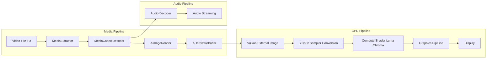

# ThiyaPlayer — Vulkan Based Hardware Video Engine for Android

**ThiyaMediaEngine** is a high-performance Android media playback SDK written in **C++ and Vulkan**.  
The engine implements a **zero-copy GPU pipeline** by bridging **MediaCodec AHardwareBuffer outputs directly into Vulkan compute and graphics pipelines**, eliminating traditional memcpy bottlenecks.

This architecture enables **low-latency processing pipelines** suitable for:

- real-time AI video filtering  
- HDR tone mapping  
- GPU accelerated video effects  
- stable 4K playback on mobile devices  

The engine is designed as a **multi-threaded asynchronous media pipeline** with explicit GPU synchronization.

- 4K video playback with compute pipeline enabled on Mali G615 MC2.
- GPU timings measured using Vulkan timestamp queries.

---

# Features

- Vulkan-based rendering pipeline  
- Zero-copy **MediaCodec → AHardwareBuffer → Vulkan** integration  
- YCbCr sampler conversion using `VK_ANDROID_external_memory_android_hardware_buffer`  
- Compute pipeline for **luma/chroma extraction**, enabling downstream AI or filter pipelines  
- Fully **multi-threaded decode and rendering architecture**  
- GPU timestamp profiling using Vulkan query pools  
- ImGui runtime debug overlay  
- Stable **4K playback tested on Mali G615 MC2**  
- **No GPU memory leaks** (verified using Vulkan validation layers)

---

# Architecture Overview

The engine is structured as an asynchronous media pipeline where decoding, rendering, and audio streaming operate independently while synchronized through explicit CPU and GPU primitives.

---

# Thread Architecture

The engine operates using the following dedicated threads:

- Extractor Thread  
- Video Decoder Thread  
- Audio Decoder Thread  
- Surface Listener Thread  
- Audio Streaming Thread  
- Vulkan Renderer Thread  

Synchronization strategy:

| Layer | Mechanism |
|------|-----------|
CPU ↔ CPU | Mutex + Condition Variables |
CPU ↔ GPU | Vulkan Fences |
GPU ↔ GPU | Vulkan Semaphores |

This design allows **non-blocking decode, compute, and rendering pipelines**.

---

# Performance for 4k videos

Device: Moto G86
GPU: Mali G615 MC2

Measured GPU timings:

| Pipeline | GPU Time |
|---------|----------|
YCbCr display pipeline | ~3 ms |
Compute + graphics pipeline | ~10 ms |

Results:

• Stable **4K playback for extended sessions**  
• **No thermal throttling observed** during testing  
• GPU timings verified using **Vulkan timestamp queries**

## Technical Challenges

The project required solving several low-level integration challenges:

- Vulkan **external memory import** from Android AHardwareBuffer  
- Synchronization between **MediaCodec decode pipeline and Vulkan rendering pipeline**  
- Correct synchronization between **audio and video decode pipelines**  
- YCbCr sampler conversion configuration  
- Compute pipeline integration for frame processing  
- GPU timestamp instrumentation  
- Debugging and eliminating **Vulkan device memory leaks**  
- Preventing **Gralloc / AImageReader hardware buffer leaks** through proper surface listener lifecycle management

## Sdk integration and usage example

[Android SDK Integration Example](binaries/integration_logic.md)

## Potential extensions for the engine:

- HDR rendering pipeline support  
- Real-time video filters implemented via compute shaders  
- AI model integration using **zero-copy GPU access to extracted luma planes**  
- GPU accelerated post-processing pipelines

---

# License

MIT License

